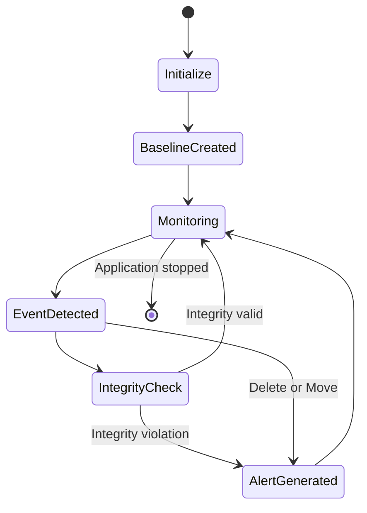

# Stage 3 — System Design & Architecture

## 1. Design Objective

The objective of the system design is to define the architecture, components, data flow, data structures and implementation approach for the Host-Based Anti-Ransomware Canary File Integrity Monitor.

The design separates the system into a C++ userspace monitoring application and a Linux kernel character-device driver.

## 2. System Architecture

The system follows this flow:

Canary File
↓
Linux inotify
↓
Filesystem Monitor
↓
Event Processor
↓
Integrity Manager (SHA-256)
↓
Alert Manager
↓
Event Logger
↓
/dev/ransomguard
↓
Linux Kernel Driver
↓
Kernel Log (dmesg)


## 3. Major Components

### 3.1 Canary Manager

Creates the protected canary file and provides the path used by the monitoring system.

### 3.2 Filesystem Monitor

Uses the Linux `inotify` API to monitor the canary file for modification, deletion and movement events.

### 3.3 Integrity Manager

Calculates the SHA-256 hash of the canary file and compares it with the stored baseline.

### 3.4 Event Processor

Receives filesystem events and determines the appropriate processing and response.

### 3.5 Alert Manager

Generates security alerts, records the events and sends security event messages to the kernel driver.

### 3.6 Event Logger

Records security events with timestamps in the application log.

### 3.7 Linux Kernel Driver

The `ransomguard` character-device driver creates `/dev/ransomguard` and receives security events from the userspace application.


## 4. Data Structures

The project uses the following important data structures:

- `inotify_event` — Linux kernel structure used to represent filesystem events.
- `std::string` — used for file paths, log messages and security event messages.
- `SHA256_CTX` — OpenSSL structure used during SHA-256 hash calculation.
- Character-device buffer — a fixed-size kernel buffer used by the `ransomguard` driver to store received security events.
- Mutex — used by the kernel driver to protect access to the shared event buffer.

## 5. Module Interaction

The modules interact in the following sequence:

1. Canary Manager creates the canary file.
2. Integrity Manager creates the initial SHA-256 baseline.
3. Filesystem Monitor starts watching the canary using `inotify`.
4. A filesystem event is detected.
5. Event Processor processes the event.
6. Integrity Manager verifies the file integrity when required.
7. Alert Manager generates the appropriate alert.
8. Event Logger records the security event.
9. Alert Manager sends the event to `/dev/ransomguard`.
10. The kernel driver receives and logs the event.


## 6. Implementation Plan

The implementation was divided into the following modules:

1. Develop the canary file management module.
2. Implement filesystem monitoring using Linux `inotify`.
3. Implement SHA-256 integrity verification.
4. Implement event processing and alert generation.
5. Implement timestamped event logging.
6. Develop the Linux character-device driver.
7. Integrate the userspace application with `/dev/ransomguard`.
8. Perform unit, integration and system testing.
9. Document the final implementation and results.

## 7. Development Environment

- Operating System: Ubuntu 26.04 LTS on WSL2
- Kernel: Custom WSL Linux kernel 6.18.40.1
- Userspace Language: C++17
- Kernel Driver Language: C
- Compiler: GCC/G++
- Build System: GNU Make
- Integrity Algorithm: SHA-256
- Filesystem API: Linux inotify
- Kernel Interface: Linux character device
- Version Control: Git/GitHub
- Editor: Visual Studio Code

## 8. Version Control Strategy

The project is maintained using Git with the `main` branch as the primary development branch.

Major development stages and completed features are committed with descriptive commit messages. Generated build artifacts are excluded using `.gitignore`.

The GitHub repository provides the source code, documentation and project history for evaluation.


## 9. Design Outcome

The system design provides a clear separation between userspace monitoring and kernel-level event handling.

The architecture supports modular development, independent testing of components, and integration through the Linux character-device interface.

The design also provides a foundation for future extensions such as multiple canary files, configurable monitoring paths and enhanced kernel-level event handling.


## 10. UML Class Diagram

The main classes of the userspace monitoring application are represented below.

```mermaid
classDiagram
    class CanaryManager {
        -string canaryPath
        +createCanary() bool
    }

    class FileSystemMonitor {
        -string filePath
        -EventProcessor processor
        +start() void
    }

    class IntegrityManager {
        -string filePath
        -string baselineHash
        +createBaseline() bool
        +verifyIntegrity() bool
    }

    class EventProcessor {
        -IntegrityManager integrity
        -AlertManager alerts
        +processModification() void
        +processDeletion() void
        +processMove() void
    }

    class AlertManager {
        -EventLogger logger
        +reportModification() void
        +reportIntegrityViolation() void
        +reportDeletion() void
        +reportMove() void
    }

    class EventLogger {
        -string logPath
        +log(string message) void
    }

    CanaryManager --> FileSystemMonitor : provides canary path
    FileSystemMonitor --> EventProcessor : sends events
    EventProcessor --> IntegrityManager : verifies integrity
    EventProcessor --> AlertManager : generates alerts
    AlertManager --> EventLogger : records events

```mermaid
sequenceDiagram
    participant CF as Canary File
    participant FM as FileSystemMonitor
    participant EP as EventProcessor
    participant IM as IntegrityManager
    participant AM as AlertManager
    participant DR as Kernel Driver

    CF->>FM: File modified
    FM->>EP: Modification event
    EP->>AM: Report modification
    AM->>DR: CANARY_MODIFIED
    EP->>IM: Verify SHA-256
    IM-->>EP: Integrity mismatch
    EP->>AM: Report integrity violation
    AM->>DR: INTEGRITY_VIOLATION
```


